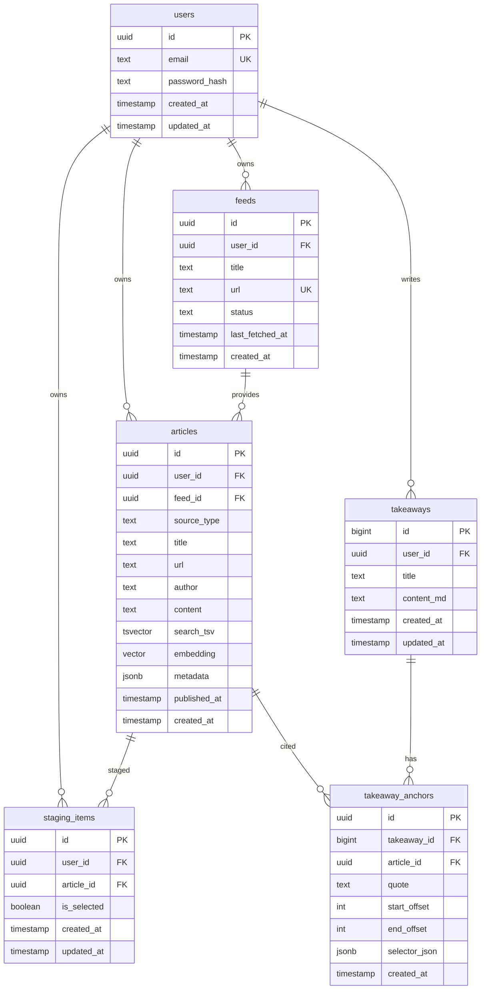

# AnkiFlow Technical Design (SDD + TDD)

## System Architecture
- Frontend: Next.js (App Router) for Dashboard, Reader, Synthesis Modal.
- Backend: FastAPI serving REST + SSE streaming.
- Data: PostgreSQL + pgvector for full-text + vector search.
- Ingestion: background jobs for RSS fetch, PDF text extraction, embedding generation.
- Search: hybrid retrieval (BM25 + vector) with optional web search provider.

## Database Schema (PostgreSQL + pgvector)



### Table Notes and Constraints
- `users`
  - `email` unique index; passwords stored as hashes.
- `feeds`
  - unique constraint on (`user_id`, `url`) to avoid duplicates.
- `articles`
  - `source_type` enum: `rss`, `pdf`, `web`.
  - `search_tsv` combines title + content for full-text search.
  - `embedding` uses `vector(1536)` (or model-specific size).
  - Indexes:
    - GIN on `search_tsv`.
    - HNSW/IVFFlat on `embedding` for vector search.
    - Optional unique on (`user_id`, `url`) or `content_hash` in `metadata`.
- `staging_items`
  - unique constraint on (`user_id`, `article_id`).
  - `is_selected` indicates inclusion in synthesis.
- `takeaways`
  - `id` is global auto-increment; displayed as `#TK-<id>`.
- `takeaway_anchors`
  - stores precise reference location using `quote` + offsets + selector.
  - for bidirectional links: derive per-article Takeaways via this table.

## API Specification (Core)

### Feeds
| Method | Path | Description |
| --- | --- | --- |
| GET | `/feeds` | List user feeds |
| POST | `/feeds` | Create new RSS feed |
| PATCH | `/feeds/{id}` | Update feed metadata |
| DELETE | `/feeds/{id}` | Remove feed |

### Articles
| Method | Path | Description |
| --- | --- | --- |
| GET | `/articles` | List articles with filters (feed, tags, source_type) |
| GET | `/articles/{id}` | Get full article content |
| POST | `/articles/import` | Import PDF or URL into library |
| GET | `/articles/{id}/takeaways` | List Takeaways referencing this article |

### Search (Hybrid)
| Method | Path | Description |
| --- | --- | --- |
| POST | `/search` | Hybrid search across local + optional web |

Request (example)
```json
{
  "query": "MoE routing comparison",
  "include_web": true,
  "top_k": 10,
  "filters": {"feed_id": "...", "source_type": ["rss", "pdf"]}
}
```

Response (example)
```json
{
  "results": [
    {"article_id": "...", "title": "Switch Transformer", "source": "local", "score": 0.82},
    {"article_id": "...", "title": "GShard", "source": "web", "score": 0.76}
  ]
}
```

### Staging
| Method | Path | Description |
| --- | --- | --- |
| GET | `/staging` | List staging items |
| POST | `/staging` | Add article to staging |
| PATCH | `/staging/{id}` | Update selection state |
| DELETE | `/staging/{id}` | Remove from staging |

### Synthesis (Streaming)
| Method | Path | Description |
| --- | --- | --- |
| POST | `/synthesis` | Stream Takeaway generation (SSE) |

Request (example)
```json
{
  "staging_item_ids": ["...", "..."],
  "prompt_preset": "balanced"
}
```

Response (SSE events)
- `delta`: incremental Markdown tokens
- `done`: final payload with `takeaway_id` and full content

## Frontend Architecture

### Component Tree (High Level)
- `AppLayout`
  - `TopBar`
  - `LeftSidebar`
    - `FeedList`
    - `StagingDock`
  - `RightSidebar`
    - `NotesPanel`
    - `AIChatPanel`

- `DashboardPage`
  - `FilterBox`
  - `ArticleList`
  - `ArticleRow`

- `ReaderPage`
  - `ReaderContextBar` (breadcrumbs + actions)
  - `ReaderContent`
  - `TOC`

- `SynthesisModal`
  - `TakeawayHeader`
  - `MarkdownEditor`
  - `ReferenceBlock`

### State Management
- `StagingContext` (React Context + React Query)
  - keeps staging items synced across Dashboard and Reader.
  - exposes `add`, `remove`, `toggleSelected`, `selectAll`.
- `SynthesisStream`
  - SSE subscription handles streaming tokens and progress state.

## Algorithms

### Hybrid Retrieval Logic
1. Run full-text search on `articles.search_tsv` (BM25).
2. Run vector search on `articles.embedding` (pgvector).
3. Merge candidates, normalize scores, and dedupe by article.
4. Optional rerank using cross-encoder or LLM reranker.
5. If `include_web` enabled, query web search provider and map results
   into `articles` as `source_type = web` with `source = web` label.
6. Return results with `source` label (`local` vs `web`).

### Anchor Location and Highlight
1. Store anchors with `quote` + `start_offset`/`end_offset` and
   `selector_json` (text-quote + text-position selectors).
2. On article load, locate anchor by exact `quote` match.
3. Fallback to offset-based range; if mismatch, use fuzzy text search.
4. Scroll to anchor element and apply highlight class.
5. Remove highlight after short timeout to preserve readability.
