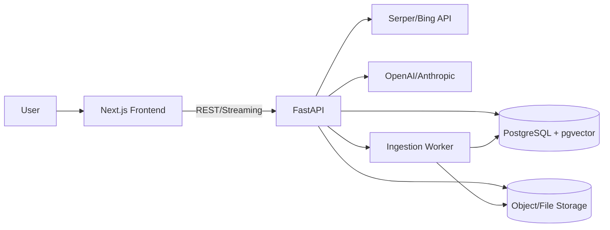

# AnkiFlow 设计规范

## 1. 系统架构图

## 2. 技术栈选型与理由
- **前端**：Next.js + React + TypeScript + Tailwind
  - 快速构建 SSR/CSR 混合应用，利于复杂阅读体验与 UI 复用。
- **后端**：Python FastAPI
  - 高性能异步接口与流式响应支持，适配 RAG/LLM 需求。
- **数据库**：PostgreSQL + pgvector
  - 同库完成业务数据与向量检索，减少系统复杂度。
- **搜索**：Serper/Bing API
  - 快速获取实时网络信息，为混合检索提供网络来源。
- **LLM**：OpenAI / Anthropic
  - 可切换提供商，满足摘要、对比、结构化输出。

## 3. 模块设计

### 模块 A：数据源与处理
- **输入**：RSS、PDF、URL。
- **处理流程**：抓取/上传 → 文本抽取 → 分段切分 → 向量化 → 存入 pgvector。
- **输出**：文档索引、标签、嵌入向量。

### 模块 B：研读工作台
- **暂存区**：跨会话持久化，支持勾选/移除/清空已读。
- **阅读器**：文章阅读 + 右侧 AI + 左侧目录与暂存坞联动。
- **混合检索**：RAG（本地）+ 网络检索，结果标注来源。

### 模块 C：智能产出
- **Takeaway 生成**：基于勾选内容生成结构化笔记。
- **锚点引用**：记录引用段落的 quote/offset，实现高亮回溯。
- **双向关联**：文章页展示相关 Takeaway，笔记中显示引用文章。

## 4. 数据模型设计（核心表结构）

| 表名             | 关键字段                                                      | 说明                    |
| ---------------- | ------------------------------------------------------------- | ----------------------- |
| users            | id, email, name, created_at                                   | 用户基础信息            |
| sources          | id, user_id, type, name, url, created_at                      | RSS/URL 来源            |
| documents        | id, user_id, source_id, type, title, url, content, created_at | 文章/PDF 文档           |
| document_chunks  | id, document_id, idx, content, token_count                    | 文档分段                |
| embeddings       | id, chunk_id, vector, provider                                | 向量索引                |
| tags             | id, name                                                      | 标签字典                |
| document_tags    | document_id, tag_id                                           | 文档与标签关联          |
| staging_items    | id, user_id, document_id, selected, created_at                | 暂存区条目              |
| takeaways        | id, user_id, title, content_md, created_at                    | 研读报告（ID 全局自增） |
| takeaway_sources | takeaway_id, document_id                                      | 笔记与文章关联          |
| anchors          | id, document_id, quote, start_offset, end_offset              | 引用锚点                |
| takeaway_refs    | takeaway_id, anchor_id, cite_label                            | 笔记引用定位            |

## 5. API 设计（核心接口）

- **导入与解析**
  - `POST /api/import/rss`：新增 RSS 源并拉取条目
  - `POST /api/import/pdf`：上传 PDF 并解析
  - `POST /api/import/url`：抓取 URL 全文
- **文档与阅读**
  - `GET /api/documents`：文档列表（含过滤）
  - `GET /api/documents/{id}`：文档详情
  - `GET /api/documents/{id}/anchors`：文档锚点
- **暂存区**
  - `GET /api/staging`：暂存区列表
  - `POST /api/staging`：加入暂存
  - `PATCH /api/staging/{id}`：勾选/取消勾选
  - `DELETE /api/staging/{id}`：移除条目
- **混合检索 & AI**
  - `POST /api/search`：本地向量检索 + 网络检索
  - `POST /api/chat`：RAG 生成（流式返回，标注来源）
- **Takeaway**
  - `POST /api/takeaways`：生成研读报告
  - `GET /api/takeaways`：研读报告列表
  - `GET /api/takeaways/{id}`：研读报告详情
  - `GET /api/documents/{id}/takeaways`：反向关联

## 6. 前端架构（页面结构、组件树）

- **页面结构**
  - **Dashboard**：顶部栏 + 左侧栏（Feed/暂存）+ 中部 Feed + 右侧 AI（默认隐藏）
  - **Reader Workbench**：紧凑顶部栏 + 左侧 TOC/暂存 + 中部阅读区 + 右侧 Notes/AI
  - **Synthesis Modal**：大尺寸弹窗，编辑 Takeaway + 引用列表

- **核心组件树（示意）**
  - `AppLayout`
  - `TopBar`（Logo / Search / Import / GlobalMore [...] / User）
  - `Sidebar`
  - `FeedList`
  - `StagingDock`
  - `FilterBox`（标签筛选 / Unread / Starred / PDF Only / ExtensionSlot [+]）
  - `ReaderCanvas`（ContextBar with Pin / Graph / ExtensionSlot [+] / More [...]）
  - `NotesPanel` / `AIChatPanel`（含联网搜索开关）
  - `SynthesisModal`（含 ExtensionSlot [...]）

- **UI 规范要点**
  - 深色主题：#121212 / #1E1E1E
  - 主色：Sky Blue #38BDF8，次级：Slate Blue #64748B
  - 字体：Inter（UI）、Merriweather（阅读）、JetBrains Mono（代码）
  - 关键动效：入坞吸附、Takeaway 按钮脉冲、锚点高亮闪烁

## 7. 第三方集成
- **RSS**：feedparser/fastapi 任务队列定期拉取
- **PDF**：PyMuPDF 或 pdfplumber 提取文本
- **Search**：Serper/Bing API（支持开关）
- **LLM**：OpenAI/Anthropic（支持切换）
- **Embedding**：OpenAI Embeddings 或本地模型（可扩展）
